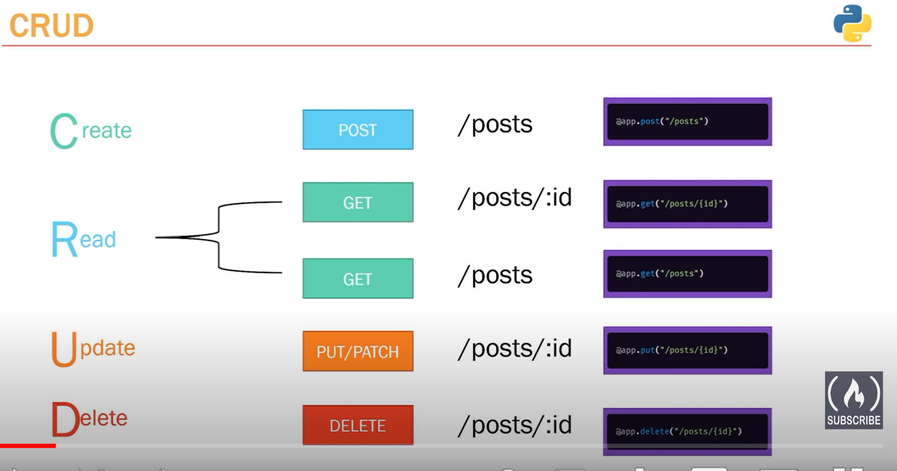
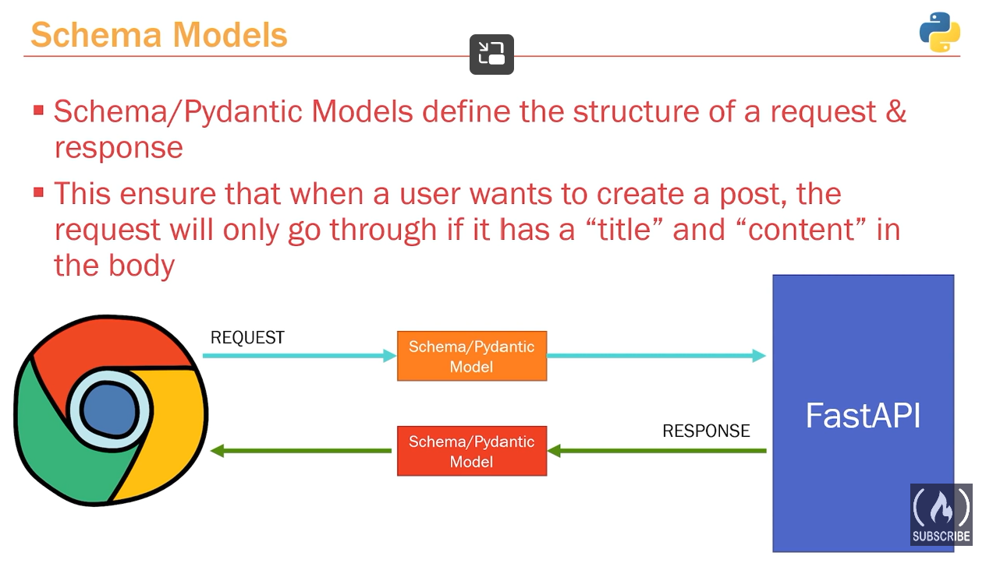
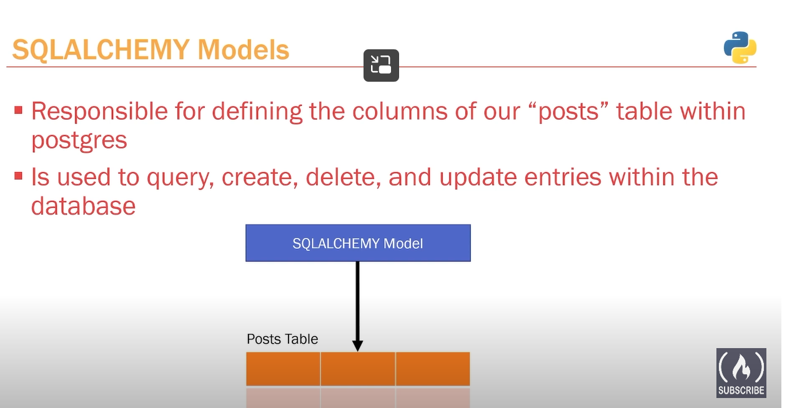
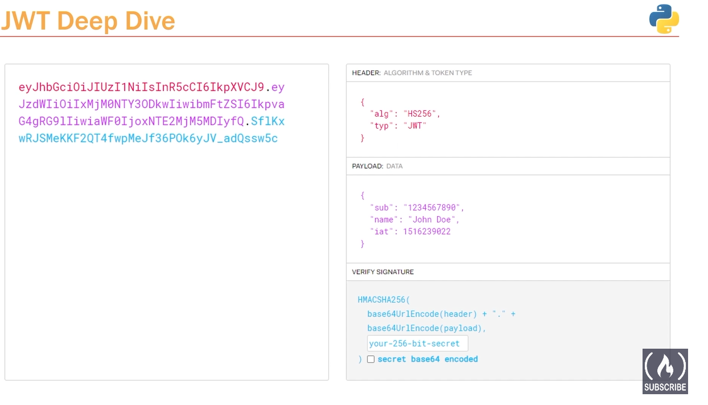
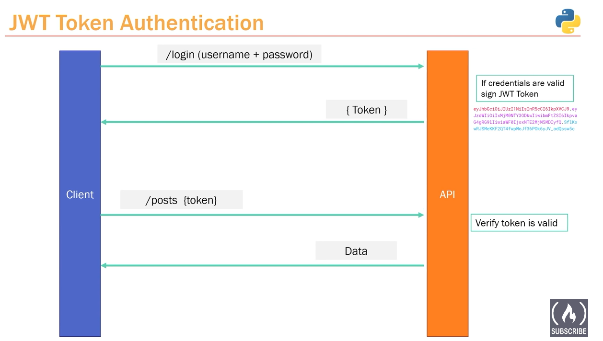
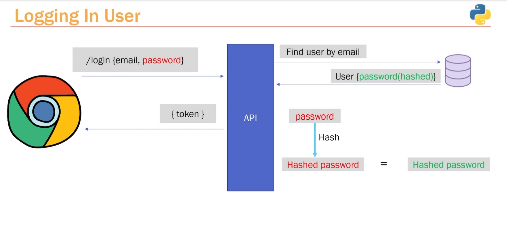
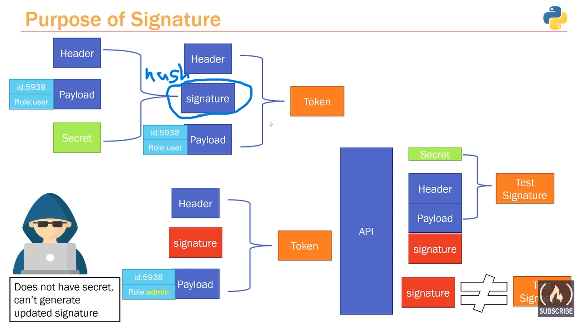

###Set up
1. set up virtual environment
``py -3 -m venv venv``

> py -3 -m venv [name]

2. set up virtual environemnt for terminal (starts this first every time)
``venv\Scripts\activate.bat``
3. install fastapi
``pip install fastapi[all]``
4. check all the packages
``pip freeze``
5. run the file
``uvicorn app.main:app``
6. automatically refresh when code changes saved
``uvicorn app.main:app --reload``
> main: the name of the file
> app: the name of the fastapi instance

###Path operation
[insert image here]
order matters: fastapi will only look at the first matching function, so if there are two functions with the same name and same path, only the first one will run.

###HTTP Request
GET: get dat from the api server
POST: create contents/data on the api server

###CRUD
The design of API need to follow the CRUD design rule
Create: ``POST``
Read: ``GET``
Update: ``PUT``
Delete: ``DELETE``

###Object Relational Mapper(ORM)
- Layer of abstraction that sits between the database and us 
- So that we no longer need to write SQL, ORM can convert our python to sql
- With ORM we can:
    - Define tables as python models
    make queries through python code
- Sqlalchemy: one of the most popular python ORMs
- Sqlalchemy does not talk to the database directly, need an underlying driver to talk to the database

###Schema/Pydantic Models VS SQLALCHEMY Models
- Schema models: define the structure of a request and a response

- SQLALCHEMY Model: define the columns of our table within postgres

###JWT token:
- not encrypted
- components:
    - header
    - payload
    - signature: verify the integrity of the data
        - hashed from header + pqyload + secret
        - check if the signature sent by users matched
    
- how it works:

###User Authentication
- Authentication process

- Signature

###testing
http://127.0.0.1:8000/docs
http://127.0.0.1:8000/redoc
pgadmin: abc123

